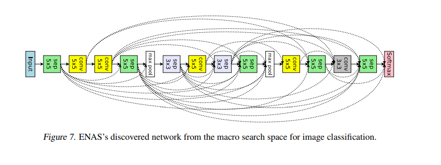

### Network Architectures And Receptive Fields

* Check this paper out: https://arxiv.org/pdf/1409.4842.pdf (Links to an external site.)
* They mention on page 6, that the RF is 224x224. 
* Use the formulas above and show the calculations

#### CIFAR10 with Skip-connections
Design this network (CIFAR10):

Image result for eNAS network architecture
The lines are the skip-connections. 
Train for 100 Epochs (add BN and ReLU after every layer)
