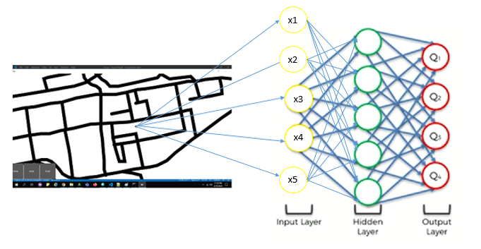
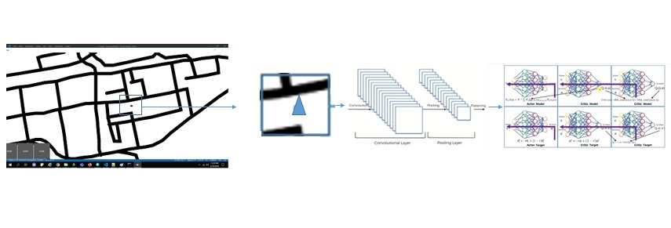
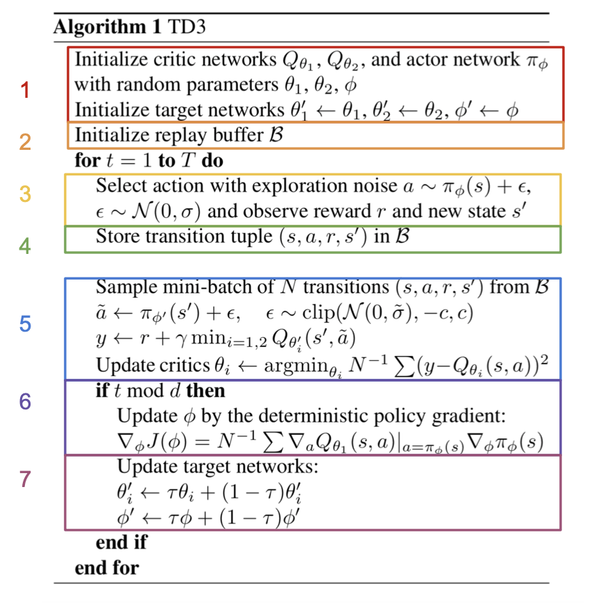

# ENDGAME

## Problem statement:
To train an autonomous car to drive in roads, avoid sand using reinforcement learning.

## Solution:
Earier we have used a Deep Q-learning approach to solve the problem. The first 3 inputs came from 3 sensors on the front, left, and right of the car which returns the density of the points around them. The last 2 inputs return the orientation of the car, a value from -1 to 1 which represents a value between -180 to 180 degrees corresponding to objective.

For EndGame, we are tweaking the above solution by using Convolution networks and state of art TD3 to improve the performance.

### Environment:
Environment is created by Kivy library where car can self-drive itself. It will move slowly on sand and smooth over roads.
car.kv file - Modeling environment components 

### Models:
CNN - Instead of taking the whole image as input, say 80 * 80 image around the car centre is being cropped and processed by CNN.
The feature vector processed by CNN is considered as state space for a TD3 model

### TD3 Model Key steps:

### Experience Replay Memory: 
We run first 10000 actions randomly and then with actions played by the actor model. Because TD3 model is off policy, we have to explore, complete full episode in order to populate the experience. Also noise can be used to explore more actions. And batc of the transitions is used for training.

[FeatureVectorstate, Featurevectorof next state, action, reward, done]

Observation, Reward, Done(Whether its completed or not), info
*Observation* - Feature vector of the image with car in centre. Basically the feature vector of the current state [80*80*1 Crop of the image overlayed with car in center may be as a triangle, GrayScale image-1 channel) the car position and the image state processed by CNN model 

Say we add a fully connected layer of 20 neurons as a last layer of our CNN model, then the 20 values will be our Observation.

*Reward* - what we got from the environment after performing the action (Reward(-5 if its moved towards sand, -1 if its moved towards road)

*done*(0/1) 1 - if its reached goal

### Rewards:
Rewards can be used to refine the learning process. Negative rewards for driving in sand/taking longer routes helps the network to learn faster. And less negative awards for going in roads will help the agent to explore more options.

### Model Training:

### Model Inference:

